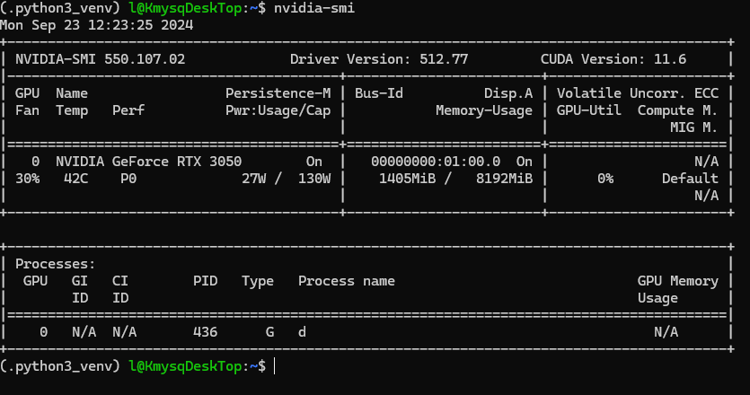
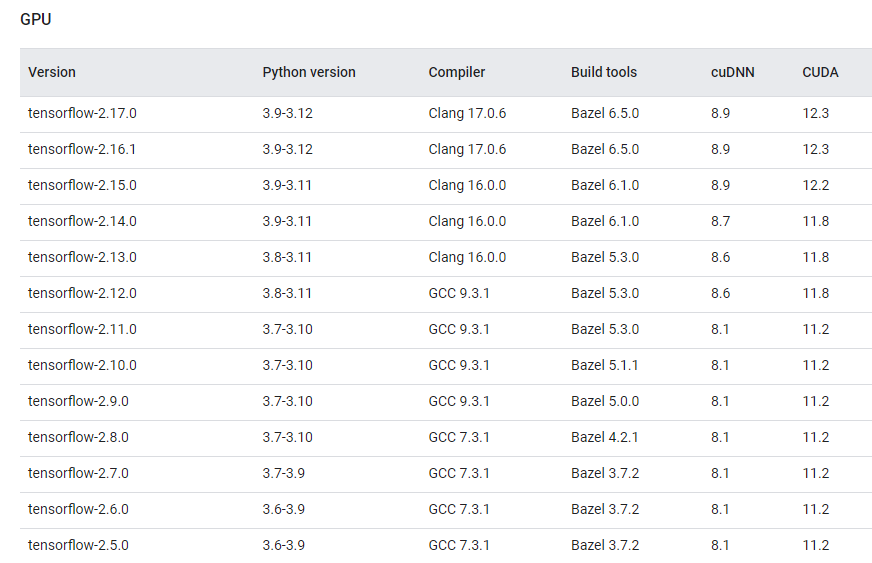

# 自宅デスクトップPCでのCUDA設定

バージョン管理が死ぬほどめんどくさそうなのでメモ

## 使用PC(自宅用デスクトップPCの)スペック

- OS : Ubuntu 22.04.4 LTSを選択(WSL2を使用)→C++コンパイラがあるから
- GPU : NVIDIA GeForce RTX 3050

## NVidiaドライバーのインストール

https://qiita.com/porizou1/items/74d8264d6381ee2941bd
 このページに従ってインストールを進めたところ、とりあえずドライバーのインストールは完了できた。
~~~
sudo add-apt-repository ppa:graphics-drivers/ppa
sudo apt update
sudo apt install nvidia-driver-460
~~~
ののちに、`sudo reboot`でおそらく大丈夫

無事インストールできた感じがする

## CUDAtoolkitのインストール

TensorFlowページにあるUbutnu18.04にCUDA tookitをインストールする手順

~~~
# Add NVIDIA package repositories
wget https://developer.download.nvidia.com/compute/cuda/repos/ubuntu1804/x86_64/cuda-ubuntu1804.pin
sudo mv cuda-ubuntu1804.pin /etc/apt/preferences.d/cuda-repository-pin-600
sudo apt-key adv --fetch-keys https://developer.download.nvidia.com/compute/cuda/repos/ubuntu1804/x86_64/7fa2af80.pub
sudo add-apt-repository "deb https://developer.download.nvidia.com/compute/cuda/repos/ubuntu1804/x86_64/ /"
sudo apt-get update

wget http://developer.download.nvidia.com/compute/machine-learning/repos/ubuntu1804/x86_64/nvidia-machine-learning-repo-ubuntu1804_1.0.0-1_amd64.deb

sudo apt install ./nvidia-machine-learning-repo-ubuntu1804_1.0.0-1_amd64.deb
sudo apt-get update

wget https://developer.download.nvidia.com/compute/machine-learning/repos/ubuntu1804/x86_64/libnvinfer7_7.1.3-1+cuda11.0_amd64.deb
sudo apt install ./libnvinfer7_7.1.3-1+cuda11.0_amd64.deb
sudo apt-get update

# Install development and runtime libraries (~4GB)
sudo apt-get install --no-install-recommends \
    cuda-11-0 \
    libcudnn8=8.0.4.30-1+cuda11.0  \
    libcudnn8-dev=8.0.4.30-1+cuda11.0

# Reboot. Check that GPUs are visible using the command: nvidia-smi

# Install TensorRT. Requires that libcudnn8 is installed above.
sudo apt-get install -y --no-install-recommends libnvinfer7=7.1.3-1+cuda11.0 \
    libnvinfer-dev=7.1.3-1+cuda11.0 \
    libnvinfer-plugin7=7.1.3-1+cuda11.0
~~~

これを以下のように改変

~~~
wget https://developer.download.nvidia.com/compute/cuda/repos/ubuntu2204/x86_64/cuda-ubuntu2204.pin
sudo mv cuda-ubuntu2204.pin /etc/apt/preferences.d/cuda-repository-pin-600
wget https://developer.download.nvidia.com/compute/cuda/12.0.0/local_installers/cuda-repo-ubuntu2204-12-0-local_12.0.0-525.60.13-1_amd64.deb
sudo dpkg -i cuda-repo-ubuntu2204-12-0-local_12.0.0-525.60.13-1_amd64.deb
sudo cp /var/cuda-repo-ubuntu2204-12-0-local/cuda-*-keyring.gpg /usr/share/keyrings/
sudo apt-get update
sudo apt-get -y install cuda
~~~

を見るに、CUDAのバージョンは12.3がよさそうだったのだが、指定してもインストールできなかった。 
困ったのでとりあえず最新バージョンをインストール。
上から順に実行していくとCUDAtookitをインストールできた。

`nvcc -V`を実行したところ以下の文言を確認できた。

~~~
nvcc: NVIDIA (R) Cuda compiler driver
Copyright (c) 2005-2022 NVIDIA Corporation
Built on Mon_Oct_24_19:12:58_PDT_2022
Cuda compilation tools, release 12.0, V12.0.76
Build cuda_12.0.r12.0/compiler.31968024_0
~~~

ちなみに`nvidia-smi`でバージョンを確認したところこんな感じでした。 
`NVIDIA-SMI 550.107.02, Driver Version: 512.77, CUDA Version: 11.6 `

## cudnnのインストール

~~~
wget https://developer.download.nvidia.com/compute/cudnn/9.4.0/local_installers/cudnn-local-repo-ubuntu2204-9.4.0_1.0-1_amd64.deb
sudo dpkg -i cudnn-local-repo-ubuntu2204-9.4.0_1.0-1_amd64.deb
sudo cp /var/cudnn-local-repo-ubuntu2204-9.4.0/cudnn-*-keyring.gpg /usr/share/keyrings/
sudo apt-get update
sudo apt-get -y install cudnn
~~~

## CONA環境の作製

バージョンを明示的に整理するためにCONDA環境を作成する。

## Pytorchのインストール

CUDAのバージョンに依存してインストールする

https://pytorch.org/get-started/previous-versions/

を参考にするとコマンドから簡単にインストールできる

 多分これで終戦です。対戦ありがとうございました。